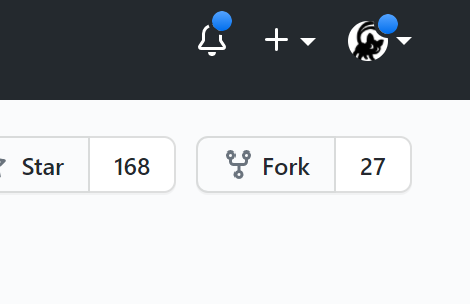
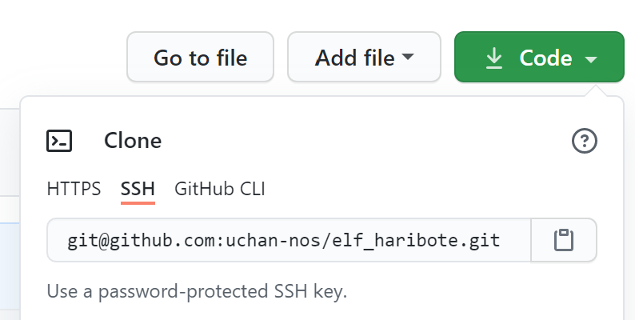
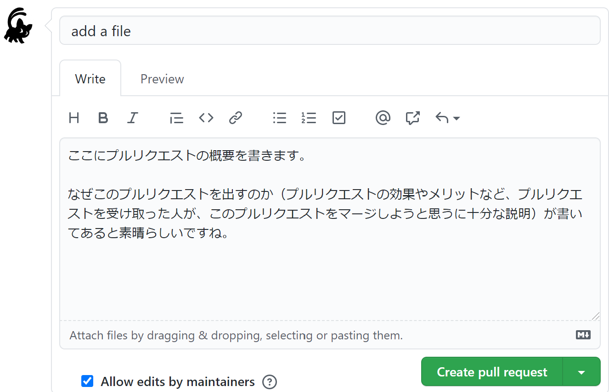

# プルリクエストの送り方

GitHub で MikanOS に対してプルリクエストを送る方法を説明します。

## プルリクエストとは

プルリクエストとは、あるリポジトリに対し、変更を提案することです。Git のプル操作を、リポジトリ所有者に対して要請（リクエスト）することから、このような名前になっています。

MikanOS のバグを修正、あるいは新機能を追加するような場合に、プルリクエストを送ることができます。
リポジトリ所有者（uchan-nos）は、プルリクエストを受け取るとその変更提案が妥当かどうかをチェックし、妥当であれば変更を受け入れます。

Issues でバグの報告や新機能の要望をするだけの場合に比べて、プルリクエストでは具体的なソースコードの変更提案を行うことができるため、迅速にバグの修正や新機能の追加ができる可能性が高くなります。
また、自分のソースコードが MikanOS に取り込まれることで、晴れて MikanOS 作者の 1 人となります。

## プルリクエストの出し方

ここで説明するのは、MikanOS に限らず、GitHub で一般に通用する方法です。
他の OSS に対して修正提案をする場合でも役立つでしょう。

プルリクエストを出す大まかな流れは次の通りです。

1. mikanos リポジトリを自分のアカウントへ Fork する
2. Fork したリポジトリに対して変更をコミットする
3. Fork したリポジトリから、元のリポジトリへのプルリクエストを作る

1 と 3 の手順は、uchan-nos/mikanos リポジトリへの書き込み権限を持たない開発者が mikanos リポジトリを変更するために必要な手順です。
uchan-nos/mikanos リポジトリは一部の開発者にのみ書き込み権限が付与されており、その他の開発者は読み込み権限しかありません。
そのため、mikanos リポジトリに変更を加えるためには、いったん、mikanos リポジトリを自分のアカウント配下へと Fork する必要があるのです。

2 の手順で、mikanos リポジトリに対し必要な修正を行います。
修正を行う際は、意味のまとまりが綺麗になるようにコミットを適切に分割するなど、一般的な開発マナーを守ってください。
修正が完了したら、3 の手順によりプルリクエストを作成し、提出します。

### mikanos リポジトリを自分のアカウントへ Fork する

mikanos リポジトリを GitHub で開くと、「Fork」と書かれたボタンがあるはずです。

ここをクリックして、自分のアカウントへ Fork してください。
Fork 先に複数の選択肢が出るかもしれませんが、特にこだわりが無ければ自分のアカウントへ Fork すれば OK です。

Fork は通常、数秒だけ時間がかかります。Fork 中は次のような表示になりますから、終わるまで待ちましょう。
（なお、この先の説明に登場する画像は osdev-jp/elf_haribote を uchan-nos アカウントへ Fork する際の表示です。
自分のリポジトリを Fork することができないので、仕方なく他人（osdev-jp）のリポジトリを Fork しています。
どなたか、mikanos リポジトリに関して本記事の手順を実行し、スクリーンショットを提供していただけませんか？）

Fork が完了すると、自分のアカウントに mikanos リポジトリが複製され、「forked from uchan-nos/mikanos」と Fork 元が表示されます。

### Fork したリポジトリに対して変更をコミットする

この手順は、通常、手元のマシンに mikanos リポジトリを git clone して行います。
普通は uchan-nos/mikanos を git clone して手元でビルドし、開発しているかと思います。
Fork したリポジトリに対して変更をコミットするには、「あなたのアカウント/mikanos」リポジトリを git clone しなければなりません。

git clone のやり方はウェブ上に記事が多数ありますので、詳しくはそれらの記事に譲るとして、以下で概略を説明します。

「あなたのアカウント/mikanos」を git clone するには、「あなたのアカウント/mikanos」を GitHub で開き、「Code」ボタンをクリックします。

Code ボタンをクリックすると「Clone」という項目の中に、HTTPS や SSH といった表示が出ます。
お好みの方法を選択し、表示された URL をコピーします。
手元のマシンのターミナルで `git clone <コピーしたURL>` というコマンドを実行すると、あなたのアカウントに Fork したリポジトリを git clone することができます。

clone したリポジトリに対し、修正を加え、デバッグし、コミットします。
一連の修正が完了したら `git push` により一連のコミットを GitHub 上へ送ります。
Fork 元のリポジトリは uchan-nos しか書き込めませんが、今 push しようとしているのは Fork した **あなたの** リポジトリですから、push できるのです。

### Fork したリポジトリから、元のリポジトリへのプルリクエストを作る

変更を push すると、GitHub のリポジトリのトップページに、次のような「Pull Request」リンクが出現します。
「This branch is 1 commit ahead of osdev-jp:master」を日本語にすると「このブランチは osdev-jp:master より1コミット進んでいます」という意味です。
Fork 元（osdev-jp:master）よりも 1 コミット新しくなっていますが、Pull Request を作成しませんか、と提案されているわけですね。

「Pull Request」リンクをクリックすると次のような画面になります。

この画面では、プルリクエストに含まれることになる差分が表示されます。
差分が正しいことを確認して、OK なら「Create Pull Request」をクリックします。

出てきた画面で、プルリクエストのタイトル、および内容を書き、「Create Pull Request」をクリックします。
これでプルリクエストが Fork 元リポジトリに提出されます。

プルリクエストは、すぐにマージされず、質問や議論のためにコメントが付くかもしれません。
コメントが付いたら返信し、マージを目指します。
